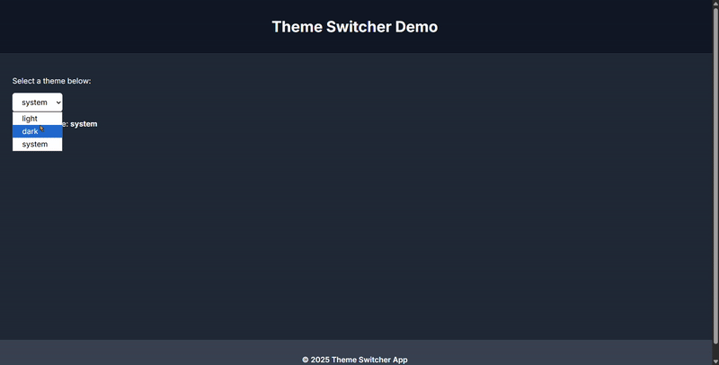

# Dynamic Theme Switcher (React + TypeScript + Context API)

A clean implementation of a **Light / Dark / System** theme switcher using:

- React Context API (no prop drilling)
- Custom `useTheme()` hook
- Local storage persistence
- OS-theme detection using `matchMedia`
- Automatic DOM class switching

---

## Project Structure

```
src/
 ├─ components/
 │   └─ ThemeSelect.tsx
 ├─ context/
 │   └─ ThemeContext.tsx
 ├─ hooks/
 │   └─ useTheme.ts
 └─ main.tsx
```

---

## How It Works

- The provider stores the **current theme** in React state.
- The provider sends `{ theme, changeTheme }` through the Context API.
- The `useTheme` hook allows any component to read/update the theme.
- An effect (`useEffect`) syncs theme with:

  - `document.body`
  - system preferences (`matchMedia`)

- Theme changes trigger a **provider re-render**
- All subscribed components update automatically.

---


